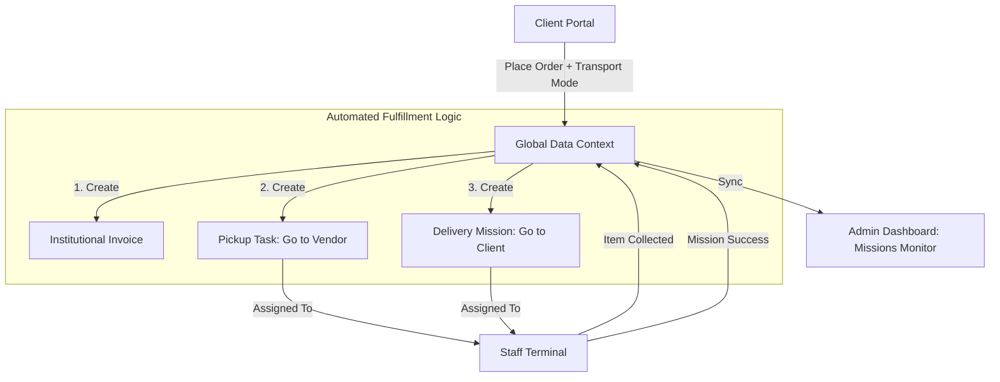

# Data Flow Architecture & Logic - ZaneZion Marketplace

## 1. Unified Institutional State
ZaneZion operates with an **Integrity-First** data architecture. All modules are synchronized via the `GlobalDataContext`, ensuring that a client's order is immediately actionable by the fulfillment team.

### **The Engine: `GlobalDataContext.jsx`**
The context manages the complete lifecycle of luxury supply requests:
- **State Registry**: Vendors, Inventory, Orders, missions, and Financials.
- **Atomic Updates**: Uses functional state updates to prevent race conditions during rapid dispatching.

---

## 2. The Platinum Operational Flow

### **Phase 1: Order Initiation (Client Store)**
1. **Trigger**: Client completes checkout in `ClientStore.jsx`.
2. **Logic**: `addOrder` function captures:
    - Multi-line asset Manifest.
    - Vendor attribution (which vendor provides which item).
    - **Transport Mode**: Road, Sea, or Air.
3. **Outcome**:
    - `Orders` state updated.
    - `Invoices` state updated.
    - **Fulfillment Sequence Triggered**.

### **Phase 2: Automated Fulfillment Sequencing**
Once an order is placed, the system automatically bifurcates the data into actionable mission profiles:
1. **Pickup Task**: A task is created for the warehouse staff/drivers to go to the **Vendor's Location** to ingest the assets into the chain.
2. **Delivery Mission**: A mission is created to transport the collected assets from the staging area to the **Client's Destination**.

### **Phase 3: Field Execution (Staff Terminal)**
- **Task Differentiation**: The `EmployeePortal` uses conditional logic to badge tasks.
    - **Type: Pickup** -> Badged as 'Task' (Blue) with Vendor location focus.
    - **Type: Delivery** -> Badged as 'Mission' (Green) with Client destination focus.
- **Lifecycle Persistence**: Pending -> Item Collected -> En Route -> Success.

---

## 3. Marketplace Logic Diagram

---

## 4. Institutional Control & Isolation
- **Data Privacy**: Client and Vendor IDs are mapped to specific institutional entities. Clients can ONLY view orders where `clientId` matches their session.
- **Roles & Access**: Permissions are checked at the component level using the **Access Matrix** (managed in Settings).
- **Log Audit**: Every state shift (e.g., 'Pickup' to 'Collected') triggers a system log for compliance audits.

---
*Proprietary ZaneZion Document • Data Integrity Protocol 2.5 (Gold Standard)*

