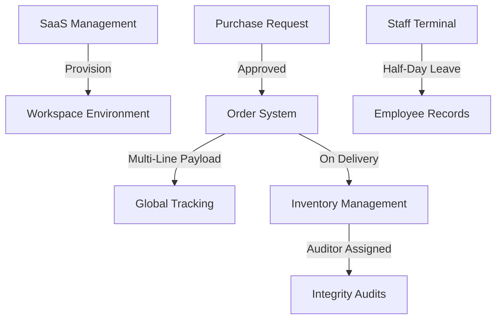

# ZaneZion Data Flow & Logical Integration Architecture

## 1. Centralized State Engine (`GlobalDataContext.jsx`)
All modules communicate through a unified data provider. This prevents data fragmentation and ensures "Zero Break" logic across the platform.

### Data Flow Diagram (Mermaid Style)

## 2. Module Integrations

### 2.1 Procurement → Logistics
When a **Purchase Request** is marked as `Approved`:
1. A new **Order** is automatically instantiated.
2. A **Logistics Log** is created for system audit.
3. The item enters the `Preparing` status in the Global Order list.

### 2.2 Logistics → Inventory
When an **Order** reaches the `Delivered` status:
1. The **Inventory System** detects the product name.
2. If the item exists, the **Quantity** is incremented.
3. If the item is new, it is registered in **Warehouse A** as a new asset with a protocol timestamp.

### 2.3 SaaS → Financials
Subscription status and plans in **SaaS Management** interact with the revenue analytics to provide an institutional overview of the platform's MRR.

### 2.4 Staff Terminal → Logistics/HR
Staff assignments Accept/Reject and **Half-Day Protocol** leave requests update the mission queue and employee balances in real-time.

## 3. UI/UX Synchronization
- **Modals**: All modals (OrderModal, VendorModal, etc.) use `useData()` to trigger state changes that immediately reflect across the Dashboard and Analytics.
- **KPI Cards**: Dashboard stats are computed dynamically from the active `orders`, `inventory`, and `fleet` arrays in real-time.

---
*Generated by Antigravity AI for ZaneZion Institutional Implementation*
