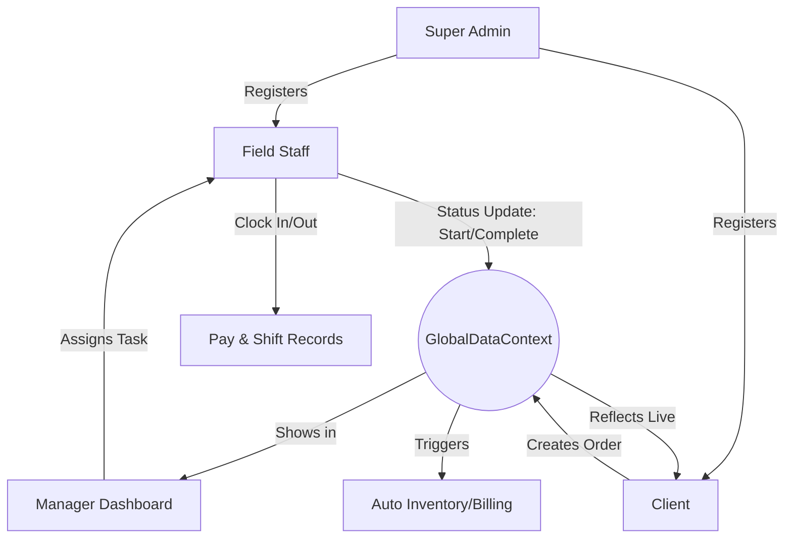

# ZaneZion Platform - Standard Operating Procedure (SOP) & Data Flow

Ye document ZaneZion platform ke roles, user actions aur data flow ko step-by-step samjhata hai.

---

## 1. User Roles & Access Control

Platform mein 3 main types ke users hain, aur har ek ka kaam alag hai:

| Role | Primary Responsibility | Key Dashboard |
| :--- | :--- | :--- |
| **Super Admin / Ops Manager** | System setup, User registration, aur Mission assignment. | `Super Admin / Operations` |
| **Institutional Client** | Order placement, Inventory tracking, aur Invoices check karna. | `Client Portal` |
| **Field Staff (Employee)** | Task execution, Shift tracking (Clock In/Out), aur POD upload karna. | `Staff Terminal` |

---

## 2. Platform Flow: Step-by-Step

### Step 1: User Onboarding (Admin Action)
*   **Action**: Admin naya User (Staff ya Client) banata hai.
*   **Location**: `Sidebar -> User Management`.
*   **Data Flow**: Jab Admin user add karta hai, wo `GlobalDataContext` ke `users` array mein save hota hai, jisse wo user login kar paata hai.

### Step 2: Creating a Request (Client Action)
*   **Action**: Client naya order create karta hai.
*   **Location**: `Client Portal -> New Order`.
*   **Important**: Client ko sirf apna naam dikhta hai aur wo apna **Department** (e.g., F&B, Housekeeping) select karta hai.
*   **Data Flow**: Order `GlobalDataContext` ke `orders` array mein `Pending` status ke saath add hota hai.

### Step 3: Dispatch & Assignment (Manager Action)
*   **Action**: Operations manager pending order ko dekhta hai aur kisi **Field Staff** ko assign karta hai.
*   **Location**: `Orders` ya `Logistics` dashboard.
*   **Data Flow**: Order ka `assignee` field update hota hai, jo Staff Terminal par trigger karta hai.

### Step 4: Mission Execution (Staff Action)
*   **Action**: Field staff login karke kaam shuru karta hai.
*   **Flow**:
    1.  **Clock In**: Staff shift timer start karta hai.
    2.  **Accept Task**: Assignment Queue se kaam uthata hai.
    3.  **Status Cycle**: Staff button dabata hai: `Accept` -> `Start` -> `En Route` -> `Complete`.
*   **Data Flow**: Har button click par `GlobalDataContext` mein order ka status real-time update hota hai.

### Step 5: Proof of Delivery & Closing (System Action)
*   **Action**: Task complete hone par staff **Proof of Delivery (POD)** upload karta hai.
*   **Data Flow**:
    - Client ko notification jata hai aur status **"Delivered"** dikhta hai.
    - `Inventory` module se stock automatic kam (decrement) ho jata hai.
    - `Invoices` section mein billing record add ho jata hai.

---

## 3. Technical Data Flow Diagram

---

## 4. UI Navigation Guide

*   **Admin**: `Dashboard`, `Users`, `Logistics`, `Procurements`.
*   **Client**: `My Dashboard`, `My Orders`, `Track Delivery`, `Asset Distribution`.
*   **Staff**: `Staff Terminal`, `My Assignments`, `Field Map`, `Pay & Records`.

---
*Proprietary ZaneZion Operating Manual • SaaS Edition v2.0*
